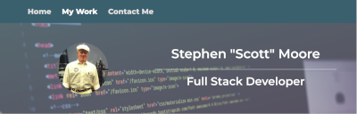
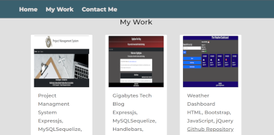

    <h3 align="center">Stephen Scott Moore React Portfolio</h3>

## License

## Description

This is a single-page application built with React.js to conditionally render content onto the page. The portfolio initially renders the "About Me" component with links to display "My Work" and "Contact Me".  
[]

## Table of Contents

- [License](#license)
- [Description](#description)
- [Table of Contents](#table-of-contents)
- [Installation Instructions](#installation-instructions)
- [Usage](#usage)
- [Contributors](#contributors)
- [Testing](#testing)
- [Questions](#questions)

  
(<a href="#top">back to top</a>)

## Installation Instructions

  <ul><li>Clone this repository by entering the following command from the command line: <code>https://github.com/judo2000/react_portfolio.git</code></li><li>Change (cd) into the newly created directory</li><li>From the command line enter: <code>npm i</code> to install all necessary packages</li><li>From the command line enter: <code>npm run start</code> to run the application</li>
  
  
(<a href="#top">back to top</a>)

  
  ## Usage
  []
  This application will allow user to view an about me page, my work page with images and links to project repositories and live pages and a contact me page when they can fill out a contat me form and send an email me me with Emailjs.

[]

  
(<a href="#top">back to top</a>)

  
    
  ## Contributors
  None

  
(<a href="#top">back to top</a>)

## Testing

There are not tests for this application.

  
(<a href="#top">back to top</a>)

## Questions

Github: [judo2000](https://github.com/judo2000) 

Email: [judo2000@comcast.net](judo2000@comcast.net)

  
(<a href="#top">back to top</a>)

